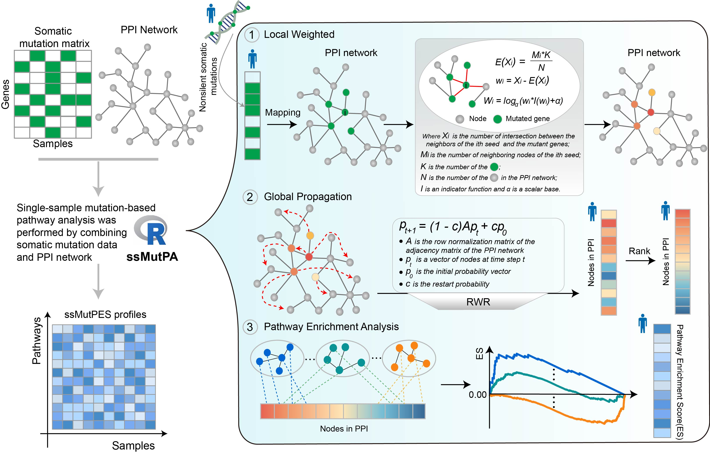

# ssMutPA

[](https://github.com/nanyuan-he/ssMutPA)
[](https://www.repostatus.org/#active)
[](https://www.gnu.org/licenses/old-licenses/gpl-2.0.en.html)
[](https://app.codacy.com/gh/nanyuan-he/ssMutPA/dashboard?utm_source=gh&utm_medium=referral&utm_content=&utm_campaign=Badge_grade)
[](https://makeapullrequest.com)
[](https://github.com/nanyuan-he/ssMutPA/commits/master)
[](https://github.com/nanyuan-he/ssMutPA)

ssMutPA is a single-sample mutation-based pathway analysis method for inferring mutation-induced pathway activity profiles.

## Introduction

`ssMutPA` is a single-sample mutation-based pathway analysis method. It integrates somatic mutation data with the protein-protein interaction network and calculates single-sample mutation-based pathway enrichment score (ssMutPES) using the local weighted and global propagation strategies.

ssMutPA complements the current individualized pathway analysis approaches that focus on gene expression data and provide something new insight into the initiation and progression of cancer.



## A notice on operating system compatibility

We recommended these dependencies to be installed:

- ** R (≥ 4.0.0)**: We developed this R package using R version 4.3.0.
- ** When calculating single-sample mutation-based pathway activity profiles, if your computer has multiple CPU cores, you can increase the computational efficiency by setting the 'Numcore' parameter in the `get_RWR_ES` function.


## Installation

Install `ssMutPA` using:

``` r
install.packages('devtools')
devtools::install_github("nanyuan-he/ssMutPA")
```


## Usage

Load the package using `library(ssMutPA)`. We provide a vignette for the package that can be called using: `vignette("ssMutPA")`. Alternatively, you can view the online version on [CRAN](https://cran.r-project.org/web/packages/ssMutPA/index.html). The examples I provided would take several minutes to run on a normal desktop computer.


